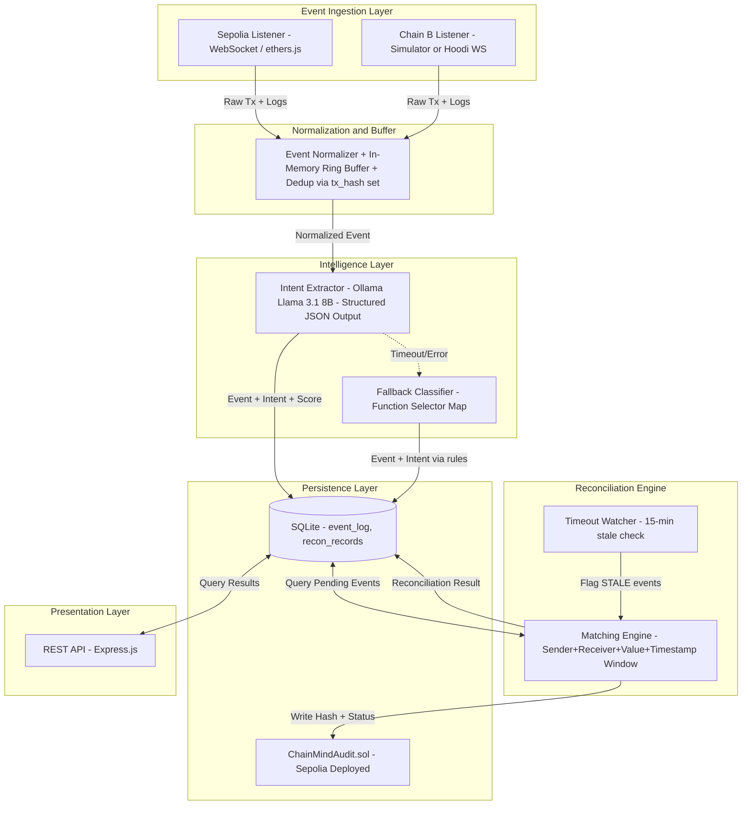
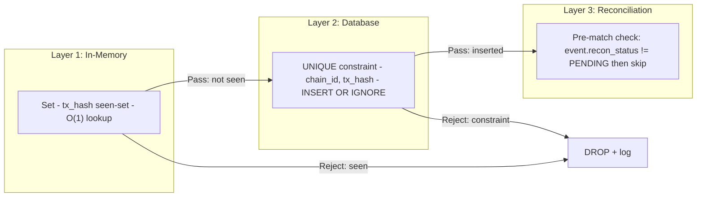

# ChainMind Audit — Implementation Blueprint

> **Document Type:** Principal Solutions Architect — Technical Design Document
> **Date:** 2026-08-23 · **Revision:** 2.0
> **Target:** 6-hour hackathon build window

---

## Table of Contents

1. [Feasibility Audit & MVP Cut](#1-feasibility-audit--mvp-cut)
2. [System Architecture](#2-system-architecture)
3. [Tech Stack with Justification](#3-tech-stack-with-justification)
4. [Data Model](#4-data-model)
5. [API Contract](#5-api-contract)
6. [Folder / Repo Structure](#6-folder--repo-structure)
7. [Identity-Resolution Logic](#7-identity-resolution-logic)
8. [Idempotency & Deduplication Strategy](#8-idempotency--deduplication-strategy)
9. [Security & Compliance Considerations](#9-security--compliance-considerations)
10. [Sequenced Build Roadmap (6-Hour Blocks)](#10-sequenced-build-roadmap)
11. [Appendices](#appendices)

---

## Assumptions Register

> [!IMPORTANT]
> The following assumptions are made due to missing information in the PRD. Each materially impacts architectural decisions.

| # | Assumption | Impact if Wrong |
|---|-----------|----------------|
| A1 | **Goerli is deprecated (EOL Jan 2024).** The PRD specifies Goerli + Sepolia, but Goerli has been non-functional since early 2024. We substitute **Sepolia + Hoodi** (the current active testnets as of Aug 2026), or alternatively run two parallel Sepolia listeners filtering on different contract addresses to simulate dual-chain. | If the judges strictly require Goerli, the system is undeliverable without a local fork (Hardhat/Anvil). |
| A2 | "No external APIs or third-party services" means **no cloud-hosted LLMs** (OpenAI, Gemini API, Anthropic). We use **Ollama running locally** with Llama 3.1 8B or Qwen 2.5 7B. | If cloud LLMs are permitted, intent extraction quality and latency improve dramatically. |
| A3 | "Cross-chain swap" in the PRD implies a **bridge pattern**: user initiates on Chain A, a relayer/bridge contract finalizes on Chain B. We reconcile these two legs. Real cross-chain swaps (e.g., CCIP, LayerZero) use protocol-specific messaging — we assume the simplified bridge model. | If actual cross-chain messaging protocols are expected, the reconciliation logic needs protocol-specific decoders. |
| A4 | The team size is **1 developer** (solo hackathon), not 3. The build roadmap is sequenced accordingly. | With 3 devs, parallelization is feasible and the stretch tier becomes achievable. |
| A5 | "Deployed on-chain" means a **single testnet deployment** for the audit contract (on Sepolia). We do not deploy the same contract to both chains. | If dual-chain contract deployment is required, double the deployment/testing time. |
| A6 | There is no existing bridge contract to monitor. We deploy a **mock bridge pair** (two simple contracts: `BridgeSender` on Chain A and `BridgeReceiver` on Chain B) that emit events we can ingest. | If we must monitor arbitrary existing contracts, the event schema and ABI decoding become open-ended. |
| A7 | The "demo video" deliverable is a **screen recording** of the system processing a transaction end-to-end, not a polished production video. | N/A |
| A8 | Faucet ETH is available. Sepolia faucets have rate limits; we need test ETH for contract deployment and mock transactions. | If faucets are dry, we pre-fund from an existing wallet or use Hardhat local forks. |

---

## 1. Feasibility Audit & MVP Cut

### 1.1 Scope-vs-Timeline Analysis

The PRD mandates **7 distinct workstreams** within 6 hours:

| Workstream | Estimated Time (Solo Dev) | Parallelizable? |
|-----------|--------------------------|-----------------|
| Dual-chain WebSocket listeners + event normalization | 1.5h | — |
| Local LLM setup (Ollama + model pull) + prompt engineering | 1.0h | Yes (during listener dev) |
| Reconciliation engine with matching logic | 1.5h | — |
| Smart contract (write + test + deploy) | 1.0h | Yes (during recon dev) |
| REST API (Express/Fastify) | 0.75h | — |
| Integration wiring + end-to-end testing | 1.0h | — |
| README + demo video recording | 0.5h | — |
| **Total** | **7.25h** | — |

> [!CAUTION]
> **Verdict: The full scope exceeds 6 hours by ~1.25h for a solo developer.** This does not account for debugging, faucet delays, Ollama model download time (~10 min for 8B model), or testnet RPC flakiness. Realistic estimate with buffer: **8–10 hours solo, 5–6 hours with 2–3 devs.**

### 1.2 Hard MVP Cut (What Ships in 6 Hours)

The MVP is defined by what is **fully functional end-to-end**, not partially built:

| Component | MVP Status | Detail |
|-----------|-----------|--------|
| Event Listener (Chain A) | ✅ **LIVE** | Single Sepolia listener via WebSocket/polling. Real testnet events. |
| Event Listener (Chain B) | ⚠️ **SIMULATED** | Second "chain" is a local event emitter replaying stored tx data with configurable delay. Uses the same normalized schema. Saves ~30 min of duplicate WebSocket plumbing. |
| Mock Bridge Contracts | ✅ **DEPLOYED** | Simple `BridgeInitiated`/`BridgeCompleted` event-emitting contracts on Sepolia. |
| Gen-AI Intent Extraction | ✅ **LIVE** | Ollama local LLM with structured JSON output. Falls back to **rule-based classifier** if Ollama is unavailable (function selector → intent mapping). |
| Reconciliation Engine | ✅ **LIVE** | Full matching logic with dedup, out-of-order handling, timeout flagging. |
| On-Chain Audit Storage | ✅ **DEPLOYED** | `ChainMindAudit.sol` on Sepolia. Event-log-based (not storage-based) for gas efficiency. |
| REST API | ✅ **LIVE** | 3 endpoints: status, summary, flagged issues. |
| README | ✅ **WRITTEN** | Setup instructions + architecture diagram. |
| Demo Video | ⚠️ **STRETCH** | Screen recording. Only if time remains in Hour 6. |

### 1.3 Stretch Tier (If Time Remains)

Ordered by incremental value:

1. **Live Chain B listener** — swap the simulator for a real Hoodi WebSocket listener (~30 min).
2. **Corrective action suggestions** — LLM generates a one-line remediation suggestion per flagged issue (~15 min prompt addition).
3. **Retry mechanism** — failed on-chain writes are queued and retried with exponential backoff (~20 min).
4. **Batch on-chain writes** — accumulate 5 reconciliations before writing to contract (~15 min).

---

## 2. System Architecture

### 2.1 Component Diagram



### 2.2 Data Flow (Numbered Sequence)

```
1. Listener detects new block → filters for bridge contract events
2. Normalizer validates + deduplicates (tx_hash check against seen-set)
3. Normalized event → Ollama /api/chat (structured JSON output)
   3a. If Ollama fails/times out (>2s) → fallback to function-selector lookup
4. Event + intent written to SQLite `event_log` table
5. Reconciliation engine polls SQLite every 1s for PENDING events
6. Engine attempts match: (sender, receiver, value, Δtimestamp ≤ 900s)
7. If matched → status = MATCHED, write to `recon_records`, emit to contract
8. If no match after 15 min → status = FLAGGED_TIMEOUT
9. REST API serves queries against SQLite
```

### 2.3 Concurrency Model

- **Single Node.js process** with async event loop (no worker threads needed at 10 evt/min).
- Listeners run as persistent async generators.
- Reconciliation engine runs on a `setInterval(1000)` tick.
- Ollama calls are `await`-ed per event (serialized) — at 10 evt/min, each call has ~6s budget; Ollama inference on 8B model takes ~1–2s locally.

---

## 3. Tech Stack with Justification

| Layer | Technology | Justification |
|-------|-----------|---------------|
| **Runtime** | Node.js 20 LTS + TypeScript | Dominant web3 ecosystem (ethers.js, Hardhat). TS provides type safety for complex schemas. Single language across all layers reduces context switching in a 6-hour build. |
| **Blockchain RPC** | ethers.js v6 | Native WebSocket provider support, robust ABI decoding, battle-tested. `viem` is lighter but ethers has better error messages for rapid debugging. No external SaaS — connects directly to public testnet RPCs. |
| **Event Buffer** | In-memory `Map<string, NormalizedEvent>` + SQLite (via `better-sqlite3`) | `Map` for O(1) dedup lookups. SQLite for durable query-able storage. Zero external dependencies — no Redis/Postgres to provision. `better-sqlite3` is synchronous (no async overhead) and embedded. |
| **Gen-AI** | Ollama (local, self-hosted) + Llama 3.1 8B Instruct | **Constraint compliant**: no external APIs. Ollama provides OpenAI-compatible `/api/chat` endpoint locally. Structured output via `format` parameter enforces JSON schema at token-sampling level. `temperature=0` eliminates randomness. |
| **Fallback Classifier** | Hardcoded `Map<string, string>` of function selectors | 4-byte function selectors (`0xa9059cbb` → `transfer`, `0x38ed1739` → `swapExactTokensForTokens`) provide deterministic intent when LLM is unavailable. Zero hallucination risk. |
| **Smart Contracts** | Solidity ^0.8.24 + Hardhat | Hardhat chosen over Foundry for JS/TS integration consistency. Hardhat has built-in testnet deployment, gas reporting, and TypeChain for type-safe contract interactions. |
| **REST API** | Express.js 4.x | Minimal boilerplate. Constraint says REST-only (no GraphQL/gRPC). Express is the fastest to scaffold. Fastify's perf gains are irrelevant at 10 req/min. |
| **Testing** | Vitest (unit) + Hardhat test (contract) | Vitest is faster than Jest, native ESM/TS support. Hardhat test for Solidity. |

### 3.1 LLM Constraint Analysis

> [!WARNING]
> **"No external APIs or third-party services"** — This constraint is ambiguous. Strictly interpreted:
> - ❌ OpenAI API, Gemini API, Anthropic API (cloud SaaS)
> - ❌ Alchemy, Infura, QuickNode (RPC providers)
> - ✅ Ollama (local, self-hosted, no network call)
> - ⚠️ Public testnet RPC endpoints (e.g., `ethereum-sepolia-rpc.publicnode.com`) — these are technically "third-party" but are the only way to connect to a testnet without running a full node.
>
> **Assumption:** Public testnet RPCs are exempted (otherwise the system is fundamentally undeliverable without 24h+ of node sync time). Cloud LLM APIs are NOT exempted.

---

## 4. Data Model

### 4.1 Event Schema (`event_log` table)

```sql
CREATE TABLE IF NOT EXISTS event_log (
    id              TEXT PRIMARY KEY,           -- UUID v4
    chain_id        INTEGER NOT NULL,           -- 11155111 (Sepolia) or simulated chain ID
    tx_hash         TEXT NOT NULL,              -- 0x... (66 chars)
    block_number    INTEGER NOT NULL,
    block_timestamp INTEGER NOT NULL,           -- Unix epoch seconds (from block)
    sender          TEXT NOT NULL,              -- 0x... checksummed address (42 chars)
    receiver        TEXT NOT NULL,              -- 0x... checksummed address (42 chars)
    value_wei       TEXT NOT NULL,              -- Wei as string (avoids JS Number precision loss)
    input_data      TEXT,                       -- Raw tx input (first 512 bytes, for intent extraction)
    function_selector TEXT,                     -- First 4 bytes of input_data (e.g., '0xa9059cbb')
    
    -- AI-enriched fields
    extracted_intent    TEXT DEFAULT 'UNKNOWN',  -- Enum: BRIDGE_INITIATE, BRIDGE_COMPLETE, SWAP, 
                                                --       DEPOSIT, WITHDRAW, TRANSFER, UNKNOWN
    intent_source       TEXT DEFAULT 'PENDING',  -- Enum: LLM, RULE_BASED, MANUAL, PENDING
    confidence_score    REAL DEFAULT 0.0,        -- 0.0 to 1.0 (LLM self-assessed or 1.0 for rule-based)
    
    -- Processing metadata
    block_confirmations INTEGER DEFAULT 0,
    ingested_at         INTEGER NOT NULL,        -- Unix epoch ms (local clock, for latency tracking)
    processed_at        INTEGER,                 -- Unix epoch ms (when intent extraction completed)
    recon_status        TEXT DEFAULT 'PENDING',   -- Enum: PENDING, MATCHED, FLAGGED_TIMEOUT, 
                                                 --       FLAGGED_DUPLICATE, FLAGGED_MISMATCH
    recon_record_id     TEXT,                    -- FK to recon_records.id (null if unmatched)

    UNIQUE(chain_id, tx_hash)                   -- Dedup constraint
);

CREATE INDEX idx_event_pending ON event_log(recon_status) WHERE recon_status = 'PENDING';
CREATE INDEX idx_event_sender ON event_log(sender, block_timestamp);
CREATE INDEX idx_event_receiver ON event_log(receiver, block_timestamp);
```

### 4.2 Reconciliation Record Schema (`recon_records` table)

```sql
CREATE TABLE IF NOT EXISTS recon_records (
    id                  TEXT PRIMARY KEY,         -- UUID v4
    
    -- Matched pair
    event_a_id          TEXT NOT NULL,             -- FK to event_log.id (Chain A event)
    event_b_id          TEXT,                      -- FK to event_log.id (Chain B event, null if timeout)
    chain_a_id          INTEGER NOT NULL,
    chain_b_id          INTEGER,
    tx_hash_a           TEXT NOT NULL,
    tx_hash_b           TEXT,
    
    -- Match quality
    match_type          TEXT NOT NULL,             -- Enum: EXACT, FUZZY_VALUE, FUZZY_TIME, TIMEOUT
    status              TEXT NOT NULL,             -- Enum: MATCHED, FLAGGED_TIMEOUT, FLAGGED_DUPLICATE,
                                                  --       FLAGGED_VALUE_MISMATCH, FLAGGED_INTENT_CONFLICT
    match_score         REAL,                      -- 0.0 to 1.0 composite match score
    
    -- Reconciliation details
    sender              TEXT NOT NULL,
    receiver            TEXT NOT NULL,
    value_a_wei         TEXT NOT NULL,
    value_b_wei         TEXT,
    value_delta_wei     TEXT DEFAULT '0',          -- |value_a - value_b| for slippage detection
    timestamp_a         INTEGER NOT NULL,
    timestamp_b         INTEGER,
    timestamp_delta_s   INTEGER,                   -- |timestamp_a - timestamp_b| in seconds
    intent_a            TEXT,
    intent_b            TEXT,
    
    -- On-chain anchoring
    anchor_tx_hash      TEXT,                      -- Tx hash of the on-chain audit write
    anchor_block        INTEGER,
    anchored_at         INTEGER,                   -- Unix epoch ms
    
    -- Metadata
    created_at          INTEGER NOT NULL,          -- Unix epoch ms
    updated_at          INTEGER NOT NULL,
    notes               TEXT                       -- LLM-generated explanation or manual override
);

CREATE INDEX idx_recon_status ON recon_records(status);
CREATE INDEX idx_recon_sender ON recon_records(sender);
CREATE INDEX idx_recon_created ON recon_records(created_at);
```

### 4.3 Smart Contract Storage Schema

```solidity
// SPDX-License-Identifier: MIT
pragma solidity ^0.8.24;

/// @title ChainMindAudit
/// @notice On-chain audit log for cross-chain reconciliation results.
/// @dev DESIGN DECISION: Event-log-only architecture.
///   Events cost ~375 + 375/topic + 8/byte = 1,500-3,000 gas per record.
///   Storage (SSTORE) costs 20,000 gas per new slot.
///   Trade-off: Data is NOT readable by other contracts, only by off-chain indexers.
///   This is acceptable for an audit system where consumers are always off-chain.
contract ChainMindAudit {
    
    address public immutable auditor;  // The backend's signing address
    uint256 public recordCount;        // Simple counter (5,000 gas after init)

    // Status Enum (packed as uint8):
    // 0 = MATCHED
    // 1 = FLAGGED_TIMEOUT
    // 2 = FLAGGED_DUPLICATE  
    // 3 = FLAGGED_VALUE_MISMATCH
    // 4 = FLAGGED_INTENT_CONFLICT

    event ReconciliationRecorded(
        bytes32 indexed reconId,       // Keccak256 of off-chain recon_record.id
        bytes32 indexed txHashA,       // Tx hash from Chain A
        bytes32 indexed txHashB,       // Tx hash from Chain B (bytes32(0) if timeout)
        uint8   status,                // Status enum
        uint64  timestampA,            // Block timestamp of Chain A event
        uint64  timestampB,            // Block timestamp of Chain B event (0 if timeout)
        address sender,                // Reconciled sender address
        uint128 valueWei               // Value in wei (uint128 max ~ 3.4e38, sufficient)
    );

    event BatchAnchored(
        uint256 batchSize,
        uint256 totalRecordCount
    );

    modifier onlyAuditor() {
        require(msg.sender == auditor, "ChainMindAudit: unauthorized");
        _;
    }

    constructor() {
        auditor = msg.sender;
    }

    /// @notice Record a single reconciliation result on-chain.
    /// @dev Gas estimate: ~28,000-35,000 (21k base + event emission + counter update)
    function recordReconciliation(
        bytes32 reconId,
        bytes32 txHashA,
        bytes32 txHashB,
        uint8   status,
        uint64  timestampA,
        uint64  timestampB,
        address sender,
        uint128 valueWei
    ) external onlyAuditor {
        emit ReconciliationRecorded(
            reconId, txHashA, txHashB, status,
            timestampA, timestampB, sender, valueWei
        );
        unchecked { recordCount++; }
    }

    /// @notice Batch-record multiple reconciliation results.
    /// @dev Gas per record in batch: ~8,000-12,000 (amortized base tx cost)
    ///      Batch of 5: ~61,000-81,000 vs 5 x 35,000 = 175,000 (65% savings)
    function batchRecordReconciliations(
        bytes32[] calldata reconIds,
        bytes32[] calldata txHashesA,
        bytes32[] calldata txHashesB,
        uint8[]   calldata statuses,
        uint64[]  calldata timestampsA,
        uint64[]  calldata timestampsB,
        address[] calldata senders,
        uint128[] calldata valuesWei
    ) external onlyAuditor {
        uint256 len = reconIds.length;
        require(
            len == txHashesA.length &&
            len == txHashesB.length &&
            len == statuses.length &&
            len == timestampsA.length &&
            len == timestampsB.length &&
            len == senders.length &&
            len == valuesWei.length,
            "ChainMindAudit: array length mismatch"
        );

        for (uint256 i = 0; i < len;) {
            emit ReconciliationRecorded(
                reconIds[i], txHashesA[i], txHashesB[i], statuses[i],
                timestampsA[i], timestampsB[i], senders[i], valuesWei[i]
            );
            unchecked { ++i; }
        }

        unchecked { recordCount += len; }
        emit BatchAnchored(len, recordCount);
    }
}
```

#### Gas Cost Estimates

| Operation | Gas Estimate | Cost at 20 gwei |
|-----------|-------------|-----------------|
| Deploy contract | ~350,000 | 0.007 ETH |
| Single `recordReconciliation` | ~32,000 | 0.00064 ETH |
| `batchRecordReconciliations` (5 records) | ~75,000 | 0.0015 ETH |
| Amortized per record in batch of 5 | ~15,000 | 0.0003 ETH |
| At 10 events/min, hourly cost (batched) | ~1,800,000 | 0.036 ETH |

> [!NOTE]
> On testnets, gas cost is irrelevant (free ETH). These estimates are for mainnet feasibility assessment. The event-log-only design is ~13x cheaper than an equivalent SSTORE-based approach.

---

## 5. API Contract

### Base URL: `http://localhost:3000/api/v1`

All responses use `Content-Type: application/json`.

---

### 5.1 `GET /api/v1/reconciliation/status`

Retrieve the reconciliation status for a specific transaction.

**Query Parameters:**

| Parameter | Type | Required | Description |
|-----------|------|----------|-------------|
| `tx_hash` | string | Yes | Transaction hash on either chain (`0x`-prefixed, 66 chars) |
| `chain_id` | integer | No | Chain ID to disambiguate (default: search both chains) |

**Response 200 OK:**

```json
{
  "success": true,
  "data": {
    "event": {
      "id": "a1b2c3d4-e5f6-7890-abcd-ef1234567890",
      "chain_id": 11155111,
      "tx_hash": "0xabc123...def",
      "sender": "0x742d35Cc6634C0532925a3b844Bc9e7595f2bD18",
      "receiver": "0x5B38Da6a701c568545dCfcB03FcB875f56beddC4",
      "value_wei": "1000000000000000000",
      "block_timestamp": 1724400000,
      "extracted_intent": "BRIDGE_INITIATE",
      "intent_source": "LLM",
      "confidence_score": 0.95,
      "block_confirmations": 24,
      "recon_status": "MATCHED"
    },
    "reconciliation": {
      "id": "f1e2d3c4-b5a6-7890-fedc-ba0987654321",
      "status": "MATCHED",
      "match_type": "EXACT",
      "match_score": 0.9375,
      "counterpart": {
        "chain_id": 17000,
        "tx_hash": "0xdef456...abc",
        "block_timestamp": 1724400120,
        "extracted_intent": "BRIDGE_COMPLETE"
      },
      "timestamp_delta_s": 120,
      "value_delta_wei": "0",
      "anchor_tx_hash": "0x789...ghi",
      "created_at": "2026-08-23T10:00:00.000Z"
    }
  }
}
```

**Response 404 Not Found:**

```json
{
  "success": false,
  "error": {
    "code": "TX_NOT_FOUND",
    "message": "Transaction 0xabc... not found in event log."
  }
}
```

---

### 5.2 `GET /api/v1/reconciliation/summary`

Retrieve an aggregate summary of all reconciliation activity.

**Query Parameters:**

| Parameter | Type | Required | Description |
|-----------|------|----------|-------------|
| `since` | integer | No | Unix epoch seconds. Only include records created after this time. Default: last 1 hour. |
| `limit` | integer | No | Max number of recent records to include. Default: 20, max: 100. |

**Response 200 OK:**

```json
{
  "success": true,
  "data": {
    "summary": {
      "total_events_ingested": 142,
      "total_reconciliations": 68,
      "status_breakdown": {
        "MATCHED": 61,
        "FLAGGED_TIMEOUT": 4,
        "FLAGGED_DUPLICATE": 2,
        "FLAGGED_VALUE_MISMATCH": 1,
        "FLAGGED_INTENT_CONFLICT": 0
      },
      "pending_events": 6,
      "avg_reconciliation_time_ms": 1840,
      "avg_timestamp_delta_s": 95,
      "on_chain_anchored": 58,
      "on_chain_pending": 10,
      "time_window": {
        "from": "2026-08-23T09:00:00.000Z",
        "to": "2026-08-23T10:00:00.000Z"
      }
    },
    "recent_records": [
      {
        "id": "f1e2d3c4-...",
        "status": "MATCHED",
        "sender": "0x742d...bD18",
        "tx_hash_a": "0xabc...",
        "tx_hash_b": "0xdef...",
        "value_wei": "1000000000000000000",
        "timestamp_delta_s": 120,
        "created_at": "2026-08-23T10:00:00.000Z"
      }
    ]
  }
}
```

---

### 5.3 `GET /api/v1/reconciliation/flagged`

Retrieve all flagged (non-MATCHED) reconciliation records.

**Query Parameters:**

| Parameter | Type | Required | Description |
|-----------|------|----------|-------------|
| `status` | string | No | Filter by: `FLAGGED_TIMEOUT`, `FLAGGED_DUPLICATE`, `FLAGGED_VALUE_MISMATCH`, `FLAGGED_INTENT_CONFLICT`. Omit for all flagged. |
| `page` | integer | No | Page number (1-indexed). Default: 1. |
| `page_size` | integer | No | Records per page. Default: 20, max: 50. |

**Response 200 OK:**

```json
{
  "success": true,
  "data": {
    "flagged_records": [
      {
        "id": "d4c3b2a1-...",
        "status": "FLAGGED_TIMEOUT",
        "severity": "HIGH",
        "sender": "0x742d...bD18",
        "event_a": {
          "chain_id": 11155111,
          "tx_hash": "0xabc...",
          "extracted_intent": "BRIDGE_INITIATE",
          "block_timestamp": 1724400000
        },
        "event_b": null,
        "reason": "No matching event found on destination chain within 900s tolerance window.",
        "suggested_action": "Verify bridge relayer status. Check destination chain for delayed confirmation.",
        "created_at": "2026-08-23T09:45:00.000Z"
      }
    ],
    "pagination": {
      "page": 1,
      "page_size": 20,
      "total_records": 7,
      "total_pages": 1
    }
  }
}
```

---

### 5.4 Error Response Schema (All Endpoints)

```json
{
  "success": false,
  "error": {
    "code": "VALIDATION_ERROR | TX_NOT_FOUND | INTERNAL_ERROR",
    "message": "Human-readable error description.",
    "details": {}
  }
}
```

| HTTP Status | Error Code | When |
|-------------|-----------|------|
| 400 | `VALIDATION_ERROR` | Missing/invalid query params |
| 404 | `TX_NOT_FOUND` | tx_hash not in database |
| 500 | `INTERNAL_ERROR` | Unexpected server error |

---

## 6. Folder / Repo Structure

```
chainmind-audit/
├── README.md                           # Setup instructions, architecture overview
├── package.json                        # Root package.json (workspaces)
├── tsconfig.json                       # Shared TypeScript config
├── .env.example                        # Environment variable template
├── .gitignore
│
├── contracts/                          # Smart contract layer
│   ├── src/
│   │   ├── ChainMindAudit.sol          # Main audit contract
│   │   └── mocks/
│   │       ├── MockBridgeSender.sol    # Emits BridgeInitiated events
│   │       └── MockBridgeReceiver.sol  # Emits BridgeCompleted events
│   ├── test/
│   │   └── ChainMindAudit.test.ts      # Contract unit tests
│   ├── scripts/
│   │   ├── deploy.ts                   # Deploy audit contract to Sepolia
│   │   └── deploy-mocks.ts            # Deploy mock bridge contracts
│   └── hardhat.config.ts
│
├── src/                                # Application source
│   ├── index.ts                        # Entry point: bootstraps all services
│   ├── config.ts                       # Centralized configuration (env vars, constants)
│   │
│   ├── listeners/                      # Event ingestion layer
│   │   ├── base-listener.ts            # Abstract listener with reconnect logic
│   │   ├── sepolia-listener.ts         # Sepolia WebSocket listener
│   │   ├── simulator-listener.ts       # Chain B event simulator (MVP)
│   │   └── types.ts                    # RawBlockchainEvent interface
│   │
│   ├── normalizer/                     # Event normalization + dedup
│   │   ├── normalizer.ts               # Canonical schema transformation
│   │   └── dedup.ts                    # Idempotency layer (seen-set + DB constraint)
│   │
│   ├── ai/                             # Gen-AI intent extraction
│   │   ├── intent-extractor.ts         # Orchestrator (LLM then fallback)
│   │   ├── ollama-client.ts            # Ollama HTTP client with structured output
│   │   ├── prompts.ts                  # System + user prompt templates
│   │   ├── fallback-classifier.ts      # Function selector to intent mapping
│   │   └── types.ts                    # IntentResult, ConfidenceScore interfaces
│   │
│   ├── reconciliation/                 # Core matching engine
│   │   ├── engine.ts                   # Main reconciliation loop
│   │   ├── matcher.ts                  # Identity resolution + value matching
│   │   ├── timeout-watcher.ts          # Stale event flagging
│   │   └── types.ts                    # ReconciliationResult, MatchType enums
│   │
│   ├── blockchain/                     # On-chain interaction
│   │   ├── contract-writer.ts          # Writes recon results to ChainMindAudit.sol
│   │   └── gas-estimator.ts            # Pre-flight gas estimation
│   │
│   ├── storage/                        # Data persistence
│   │   ├── database.ts                 # SQLite connection + migrations
│   │   ├── event-repository.ts         # CRUD for event_log table
│   │   └── recon-repository.ts         # CRUD for recon_records table
│   │
│   ├── api/                            # REST API layer
│   │   ├── server.ts                   # Express app setup + middleware
│   │   ├── routes/
│   │   │   └── reconciliation.ts       # /api/v1/reconciliation/* routes
│   │   └── middleware/
│   │       ├── error-handler.ts        # Global error handler
│   │       └── validator.ts            # Query param validation
│   │
│   └── utils/                          # Shared utilities
│       ├── logger.ts                   # Structured logging (pino)
│       ├── uuid.ts                     # UUID v4 generator
│       └── address.ts                  # Checksum address normalization
│
├── tests/                              # Test suite
│   ├── unit/
│   │   ├── normalizer.test.ts
│   │   ├── intent-extractor.test.ts
│   │   ├── matcher.test.ts
│   │   └── dedup.test.ts
│   ├── integration/
│   │   └── pipeline.test.ts            # End-to-end event to recon flow
│   └── fixtures/
│       ├── sample-events.json          # Test event payloads
│       └── sample-transactions.json    # Raw testnet tx data
│
└── docs/
    └── architecture.md                 # Detailed architecture documentation
```

---

## 7. Identity-Resolution Logic

### 7.1 The Core Problem

A "cross-chain transaction" is **not a single atomic operation**. It is two independent blockchain transactions that are logically related but have:
- Different transaction hashes
- Different block numbers and timestamps
- Potentially different gas costs (not part of the value)
- Asynchronous confirmation (seconds to minutes apart)

There is **no on-chain foreign key** linking Chain A's `BridgeInitiated` event to Chain B's `BridgeCompleted` event.

### 7.2 Matching Heuristic (Multi-Factor Weighted Scoring)

We use a **weighted composite score** rather than a single exact-match key:

```typescript
interface MatchCandidate {
  eventA: NormalizedEvent;   // Source chain event (e.g., BRIDGE_INITIATE)
  eventB: NormalizedEvent;   // Destination chain event (e.g., BRIDGE_COMPLETE)
  score: number;             // 0.0 to 1.0
  matchType: 'EXACT' | 'FUZZY_VALUE' | 'FUZZY_TIME';
}

function computeMatchScore(a: NormalizedEvent, b: NormalizedEvent): MatchCandidate | null {
  let score = 0;
  const MAX_SCORE = 4.0;

  // -- Factor 1: Sender Match (weight: 1.5) --
  // Addresses MUST be checksummed before comparison.
  // Direct match: same sender on both chains (common in bridge patterns)
  if (normalizeAddress(a.sender) === normalizeAddress(b.sender)) {
    score += 1.5;
  } else {
    return null; // Hard requirement: no match without sender correlation
  }

  // -- Factor 2: Receiver Match (weight: 1.0) --
  // In bridge pattern: receiver on Chain A = bridge contract
  //                    receiver on Chain B = end user (may == sender)
  // We check: a.receiver == b.receiver OR b.receiver == a.sender
  if (normalizeAddress(a.receiver) === normalizeAddress(b.receiver)) {
    score += 1.0;
  } else if (normalizeAddress(b.receiver) === normalizeAddress(a.sender)) {
    score += 0.75; // Bridge self-receive pattern
  }
  // If neither, receiver contributes 0 (still possible match via other factors)

  // -- Factor 3: Value Match (weight: 1.0) --
  const valueA = BigInt(a.value_wei);
  const valueB = BigInt(b.value_wei);
  const delta = valueA > valueB ? valueA - valueB : valueB - valueA;
  const maxVal = valueA > valueB ? valueA : valueB;

  if (delta === 0n) {
    score += 1.0;           // Exact value match
  } else if (maxVal > 0n && (delta * 10000n / maxVal) <= 100n) {
    score += 0.5;           // Within 1% (bridge fees/slippage)
  }
  // >1% delta: suspicious, contributes 0

  // -- Factor 4: Timestamp Proximity (weight: 0.5) --
  const timeDelta = Math.abs(a.block_timestamp - b.block_timestamp);
  if (timeDelta <= 120) {
    score += 0.5;           // Within 2 minutes
  } else if (timeDelta <= 900) {
    score += 0.25;          // Within 15 minutes
  }
  // >15 minutes: no temporal correlation

  // -- Threshold --
  const normalizedScore = score / MAX_SCORE;
  if (normalizedScore >= 0.625) {   // Minimum: sender + value + partial time
    return {
      eventA: a,
      eventB: b,
      score: normalizedScore,
      matchType: delta === 0n ? 'EXACT' : 'FUZZY_VALUE'
    };
  }

  return null;
}
```

### 7.3 Matching Algorithm

```
1. For each new PENDING event E:
   a. Query all PENDING events from the OTHER chain within +/-900s of E.block_timestamp
   b. Filter to those where sender matches
   c. Compute match score for each candidate
   d. If best candidate score >= 0.625:
      - Create reconciliation record with status MATCHED
      - Mark both events as MATCHED
   e. If no candidate found:
      - Leave as PENDING (timeout watcher will flag after 900s)
```

### 7.4 Intent Consistency Check

After matching, we validate that intents are **logically complementary**:

| Event A Intent | Event B Intent | Valid? | Notes |
|---------------|---------------|--------|-------|
| BRIDGE_INITIATE | BRIDGE_COMPLETE | ✅ | Expected bridge flow |
| SWAP | SWAP | ✅ | Cross-chain swap |
| DEPOSIT | WITHDRAW | ✅ | Cross-chain yield farming |
| BRIDGE_INITIATE | SWAP | ⚠️ | Flag as `FLAGGED_INTENT_CONFLICT` |
| TRANSFER | UNKNOWN | ⚠️ | Log warning, allow match |
| UNKNOWN | UNKNOWN | ✅ | Both unclassified: match on data only |

### 7.5 Failure Modes

| Failure Mode | Probability | Consequence | Mitigation |
|-------------|-------------|-------------|------------|
| **Same sender, similar value, coincidental timing** | Low on testnets, moderate on mainnet | False positive match | Require intent complementarity check. Add nonce correlation if available. |
| **Bridge uses intermediate relayer address** | High in production bridges | Sender on Chain B != sender on Chain A, causing no match | For MVP: our mock bridge uses same sender. For production: maintain a relayer address mapping table. |
| **Value changes due to fees/slippage** | Moderate | Exact match fails | 1% fuzzy tolerance is built in. Production: configurable per bridge protocol. |
| **Events arrive >15 min apart** (congestion, reorg) | Low on testnets | Timeout flag despite valid transaction | Configurable `TOLERANCE_WINDOW`. Stretch goal: automatic retry on timeout. |
| **One-to-many: single Chain A event triggers multiple Chain B events** | Rare (protocol-specific) | Only first is matched, rest flagged as duplicate | Design limitation in MVP. Production: support 1:N reconciliation groups. |

---

## 8. Idempotency & Deduplication Strategy

### 8.1 Deduplication Layers (Defense in Depth)



#### Layer 1: In-Memory Seen-Set

```typescript
class EventDeduplicator {
  // Map of "chainId:txHash" to ingestion timestamp
  private seenSet: Map<string, number> = new Map();
  
  // Evict entries older than 30 minutes to prevent unbounded memory growth
  private readonly EVICTION_WINDOW_MS = 30 * 60 * 1000;

  isDuplicate(chainId: number, txHash: string): boolean {
    const key = `${chainId}:${txHash.toLowerCase()}`;
    if (this.seenSet.has(key)) {
      return true;  // Already seen: DROP
    }
    this.seenSet.set(key, Date.now());
    return false;
  }

  // Called on interval to prevent memory leak
  evictStale(): void {
    const cutoff = Date.now() - this.EVICTION_WINDOW_MS;
    for (const [key, ts] of this.seenSet) {
      if (ts < cutoff) this.seenSet.delete(key);
    }
  }
}
```

#### Layer 2: Database Constraint

```sql
-- INSERT OR IGNORE silently drops duplicates that violate UNIQUE constraint
INSERT OR IGNORE INTO event_log (id, chain_id, tx_hash, ...) VALUES (?, ?, ?, ...);
```

This handles the case where the process restarts (losing Layer 1's in-memory set) and replays recent blocks.

#### Layer 3: Reconciliation Guard

The matching engine only considers events with `recon_status = 'PENDING'`. Events that are already `MATCHED` or `FLAGGED_*` are never re-processed.

### 8.2 Out-of-Order Event Handling

**Problem:** Events may arrive in non-chronological order due to:
- Different block times across chains (Sepolia ~12s, Hoodi varies)
- WebSocket reconnection replaying missed blocks
- Network latency variations

**Strategy: Timestamp-Independent Matching**

The reconciliation engine does NOT assume events arrive in order. Instead:

1. **Matching uses `block_timestamp`** (from the blockchain), not local ingestion time. This is immutable and deterministic.
2. **The engine scans ALL pending events** within the tolerance window, not just "newer" ones.
3. **Out-of-order detection:** If event B (destination) has `block_timestamp < event A (source).block_timestamp`, the match is still created but the reconciliation record is annotated with `notes: "Out-of-order: destination confirmed before source (clock skew or L2 pre-confirmation)"`.

```typescript
// The matching query is timestamp-window-based, not order-based:
const candidates = db.prepare(`
  SELECT * FROM event_log 
  WHERE chain_id != ? 
    AND recon_status = 'PENDING'
    AND ABS(block_timestamp - ?) <= ?
    AND LOWER(sender) = LOWER(?)
`).all(event.chain_id, event.block_timestamp, TOLERANCE_WINDOW_S, event.sender);
```

### 8.3 Idempotent On-Chain Writes

The smart contract uses `reconId` (keccak256 of the off-chain UUID) as an indexed event topic. While Solidity events are append-only (no on-chain duplication prevention), we prevent duplicate writes at the application layer:

```typescript
// Only write to chain if anchor_tx_hash is NULL
const unanchored = db.prepare(`
  SELECT * FROM recon_records 
  WHERE anchor_tx_hash IS NULL 
    AND status IN ('MATCHED', 'FLAGGED_TIMEOUT', 'FLAGGED_VALUE_MISMATCH', 'FLAGGED_INTENT_CONFLICT')
`).all();
```

If the on-chain write succeeds, we update `anchor_tx_hash`. If the write fails (tx reverts, nonce conflict), it remains `NULL` and will be retried on the next cycle.

---

## 9. Security & Compliance Considerations

### 9.1 Private Key Handling

> [!CAUTION]
> The backend must sign transactions to write to `ChainMindAudit.sol`. This requires a private key.

| Aspect | Implementation | Risk Level |
|--------|---------------|------------|
| **Key Storage** | `.env` file, loaded via `dotenv`, never committed to git. `.env` is in `.gitignore`. | Medium (acceptable for hackathon; production requires HSM/KMS) |
| **Key Scope** | Dedicated "auditor" wallet with minimal ETH (just enough for gas). No other funds. | Low |
| **Key Rotation** | Not implemented in MVP. Production: rotate via contract `transferAuditor()` function. | Medium |
| **Alternative (Stretch)** | Use Hardhat's `hardhat-ethers` signer abstraction with a mnemonic-derived HD wallet. | Low |

```typescript
// config.ts: key is NEVER logged or exposed via API
const AUDITOR_PRIVATE_KEY = process.env.AUDITOR_PRIVATE_KEY;
if (!AUDITOR_PRIVATE_KEY) throw new Error('AUDITOR_PRIVATE_KEY must be set in .env');

// Wallet is instantiated once, never serialized
const wallet = new ethers.Wallet(AUDITOR_PRIVATE_KEY, provider);
```

### 9.2 Audit-Log Immutability

| Property | How It's Achieved |
|----------|------------------|
| **On-chain immutability** | Ethereum event logs are part of the blockchain and cannot be altered or deleted. Once `ReconciliationRecorded` is emitted, it is permanent. |
| **Off-chain tamper evidence** | SQLite database is local and mutable. For production: append `anchor_tx_hash` to each record, allowing auditors to verify off-chain records against on-chain events. |
| **Non-repudiation** | On-chain writes are signed by the auditor's private key. The `auditor` address is stored in the contract's immutable storage. All writes are traceable to this address. |
| **Gap detection** | `recordCount` in the contract is a monotonic counter. Off-chain systems can verify that no records were skipped by comparing their count with `contract.recordCount()`. |

### 9.3 False-Positive Risk in Fraud Flagging

> [!WARNING]
> The system flags discrepancies, not fraud. The word "fraud" should be avoided in user-facing output. Use "discrepancy" or "anomaly."

| Flag Type | False-Positive Risk | Mitigation |
|-----------|-------------------|------------|
| `FLAGGED_TIMEOUT` | **High** — testnet congestion, faucet delays, slow relayers all cause legitimate delays beyond 15 min. | Configurable tolerance window. UI should present as "Awaiting confirmation" not "Fraud detected." |
| `FLAGGED_VALUE_MISMATCH` | **Medium** — bridge fees, gas refunds, token decimals mismatch. | 1% tolerance band. Log the exact delta for manual review. |
| `FLAGGED_INTENT_CONFLICT` | **High** — LLM misclassification is the primary risk vector. Confidence scores below 0.7 should be treated as UNKNOWN. | Fallback to rule-based classifier. Never flag based solely on LLM output — require data-level evidence (value/address mismatch). |
| `FLAGGED_DUPLICATE` | **Low** — tx_hash is globally unique per chain. | Only triggers if same tx_hash arrives twice (WebSocket replay), which is correctly handled by dedup. |

### 9.4 LLM Hallucination Guardrails

```typescript
// prompts.ts: Anti-hallucination prompt engineering

const SYSTEM_PROMPT = `You are a blockchain transaction classifier. 
Your ONLY job is to classify the intent of an Ethereum transaction.

RULES:
1. You MUST respond with ONLY a JSON object. No explanation, no markdown, no preamble.
2. You MUST use EXACTLY one of these intent values: 
   BRIDGE_INITIATE, BRIDGE_COMPLETE, SWAP, DEPOSIT, WITHDRAW, TRANSFER, UNKNOWN
3. If you are not confident, use "UNKNOWN". Never guess.
4. Your confidence_score must be between 0.0 and 1.0.
5. Do NOT invent transaction details. Only use information provided in the input.

OUTPUT FORMAT (strict):
{"intent": "BRIDGE_INITIATE", "confidence_score": 0.92, "reasoning": "..."}`;

// Ollama call with structured output enforcement
const response = await fetch('http://localhost:11434/api/chat', {
  method: 'POST',
  body: JSON.stringify({
    model: 'llama3.1:8b',
    messages: [
      { role: 'system', content: SYSTEM_PROMPT },
      { role: 'user', content: buildUserPrompt(event) }
    ],
    format: {
      type: 'object',
      properties: {
        intent: { 
          type: 'string', 
          enum: ['BRIDGE_INITIATE', 'BRIDGE_COMPLETE', 'SWAP', 
                 'DEPOSIT', 'WITHDRAW', 'TRANSFER', 'UNKNOWN'] 
        },
        confidence_score: { type: 'number', minimum: 0, maximum: 1 },
        reasoning: { type: 'string' }
      },
      required: ['intent', 'confidence_score', 'reasoning']
    },
    stream: false,
    options: { temperature: 0, num_predict: 200 }
  })
});
```

**Additional guardrails:**
- **Timeout:** If Ollama does not respond in 2 seconds, fall back to rule-based classifier.
- **Validation:** Even with structured output, validate the response against the schema. Reject malformed responses.
- **Confidence floor:** Any `confidence_score < 0.5` is overridden to `UNKNOWN`.
- **No action on LLM-only evidence:** The system never creates a `FLAGGED_*` status based solely on LLM output. Flags require data-level evidence (value mismatch, timeout, etc.).

### 9.5 Additional Security Measures

| Concern | Implementation |
|---------|---------------|
| **API rate limiting** | Express `express-rate-limit`: 100 req/min per IP. Prevents abuse of the status endpoint. |
| **Input sanitization** | All `tx_hash` and `address` params are validated against regex before any DB query. |
| **SQL injection** | `better-sqlite3` uses parameterized queries exclusively. No string concatenation in SQL. |
| **Error leakage** | Production error handler strips stack traces and internal details from 5xx responses. |

---

## 10. Sequenced Build Roadmap (6-Hour Blocks)

> **Assumption:** Solo developer. All times include testing within each block.

### Hour 0:00-1:00 — Foundation & Smart Contract

| Minute | Task | Output |
|--------|------|--------|
| 0:00 | Initialize monorepo: `npm init`, `tsconfig.json`, install deps | Working Node.js + Hardhat project |
| 0:15 | Write `ChainMindAudit.sol` + `MockBridgeSender.sol` + `MockBridgeReceiver.sol` | 3 Solidity files |
| 0:35 | Write Hardhat deploy scripts (`deploy.ts`, `deploy-mocks.ts`) | Deployment scripts |
| 0:40 | Run `npx hardhat test` on contracts (basic smoke test) | Passing contract tests |
| 0:50 | Deploy all contracts to Sepolia. Record addresses in `.env` | Deployed contracts |
| 0:55 | Pull Ollama model: `ollama pull llama3.1:8b` (runs in background) | Model downloading |

> [!TIP]
> Start the Ollama model pull at minute 55: it takes 5-10 minutes and can run while you work on the next block.

---

### Hour 1:00-2:00 — Data Layer + Event Listeners

| Minute | Task | Output |
|--------|------|--------|
| 1:00 | Create `src/config.ts`, `src/storage/database.ts` (SQLite schema + migrations) | Working database |
| 1:15 | Create `src/storage/event-repository.ts` + `src/storage/recon-repository.ts` | CRUD layer |
| 1:30 | Create `src/listeners/base-listener.ts` (WebSocket reconnect logic) | Base class |
| 1:40 | Create `src/listeners/sepolia-listener.ts` (filters for MockBridge events) | Working Chain A listener |
| 1:50 | Create `src/listeners/simulator-listener.ts` (replays canned events as Chain B) | Working Chain B simulator |
| 1:55 | Create `src/normalizer/normalizer.ts` + `src/normalizer/dedup.ts` | Normalization pipeline |

**Checkpoint:** Send a test transaction to MockBridgeSender on Sepolia. Verify it appears in SQLite.

---

### Hour 2:00-3:00 — AI Intent Extraction + Fallback

| Minute | Task | Output |
|--------|------|--------|
| 2:00 | Create `src/ai/prompts.ts` (system prompt + user prompt template) | Prompt templates |
| 2:10 | Create `src/ai/ollama-client.ts` (HTTP client with timeout + structured output) | LLM client |
| 2:25 | Create `src/ai/fallback-classifier.ts` (function selector map) | Rule-based fallback |
| 2:35 | Create `src/ai/intent-extractor.ts` (orchestrator: LLM then fallback) | Intent pipeline |
| 2:45 | Test: feed sample events through intent extractor, verify JSON output | Validated intent extraction |
| 2:55 | Wire normalizer to intent extractor to SQLite update | Events get intents |

**Checkpoint:** Events in SQLite now have `extracted_intent` and `confidence_score` populated.

---

### Hour 3:00-4:00 — Reconciliation Engine

| Minute | Task | Output |
|--------|------|--------|
| 3:00 | Create `src/reconciliation/matcher.ts` (match scoring algorithm from Section 7.2) | Matching function |
| 3:15 | Create `src/reconciliation/timeout-watcher.ts` (15-min stale event flagger) | Timeout logic |
| 3:25 | Create `src/reconciliation/engine.ts` (main loop: poll, match, write) | Reconciliation engine |
| 3:40 | Create `src/blockchain/contract-writer.ts` (ethers.js contract interaction) | On-chain writer |
| 3:50 | Wire engine to contract-writer (write MATCHED/FLAGGED to chain) | Full pipeline |
| 3:55 | Test: trigger mock bridge tx, verify reconciliation + on-chain event | End-to-end flow |

**Checkpoint:** Full pipeline works: event to normalize to intent to match to on-chain write.

---

### Hour 4:00-5:00 — REST API + Integration

| Minute | Task | Output |
|--------|------|--------|
| 4:00 | Create `src/api/server.ts` (Express setup, CORS, JSON middleware) | API server |
| 4:10 | Create `src/api/routes/reconciliation.ts` (3 endpoints from Section 5) | Route handlers |
| 4:20 | Create `src/api/middleware/validator.ts` + `error-handler.ts` | Input validation |
| 4:30 | Create `src/index.ts` (bootstrap: start listeners, engine, API) | Main entry point |
| 4:40 | Full integration test: start system, send testnet tx, query API | API returns data |
| 4:55 | Fix bugs from integration | Stable system |

**Checkpoint:** `curl http://localhost:3000/api/v1/reconciliation/summary` returns live data.

---

### Hour 5:00-6:00 — Polish, README, Demo

| Minute | Task | Output |
|--------|------|--------|
| 5:00 | Write unit tests (normalizer, matcher, dedup: highest-value tests) | Test suite |
| 5:15 | Write README.md (setup instructions, architecture diagram, API docs) | Documentation |
| 5:30 | Edge case testing: duplicate events, out-of-order, timeout scenarios | Hardened system |
| 5:45 | **Stretch:** Record demo video (screen recording of end-to-end flow) | Demo video |
| 5:55 | Final cleanup: remove debug logs, verify `.env.example`, git commit | Ship-ready |

---

### Build Roadmap Visualization

```mermaid
gantt
    title ChainMind Audit: 6-Hour Build Roadmap
    dateFormat HH:mm
    axisFormat %H:%M

    section Foundation
    Monorepo setup              :a1, 00:00, 15m
    Solidity contracts           :a2, 00:15, 20m
    Hardhat tests and deploy     :a3, 00:35, 20m
    Ollama model pull            :a4, 00:55, 10m

    section Data Layer
    SQLite schema and repos      :b1, 01:00, 30m
    WebSocket listener           :b2, 01:30, 20m
    Simulator and normalizer     :b3, 01:50, 10m

    section AI Layer
    Prompts and Ollama client    :c1, 02:00, 25m
    Fallback classifier          :c2, 02:25, 10m
    Intent orchestrator          :c3, 02:35, 25m

    section Recon Engine
    Matcher algorithm            :d1, 03:00, 15m
    Timeout watcher              :d2, 03:15, 10m
    Engine and contract write    :d3, 03:25, 30m
    E2E test                     :d4, 03:55, 5m

    section REST API
    Express and routes           :e1, 04:00, 30m
    Validation and errors        :e2, 04:30, 10m
    Bootstrap and integration    :e3, 04:40, 20m

    section Polish
    Unit tests                   :f1, 05:00, 15m
    README                       :f2, 05:15, 15m
    Edge case testing            :f3, 05:30, 15m
    Demo video stretch           :f4, 05:45, 10m
    Final cleanup                :f5, 05:55, 5m
```



---

## Appendices

### Appendix A: Environment Variables

```bash
# .env.example

# -- Blockchain --
SEPOLIA_RPC_URL=wss://ethereum-sepolia-rpc.publicnode.com
SEPOLIA_HTTP_URL=https://ethereum-sepolia-rpc.publicnode.com
AUDITOR_PRIVATE_KEY=0x...          # Private key for contract writes (testnet only!)
CHAINMIND_CONTRACT_ADDRESS=0x...   # Deployed ChainMindAudit.sol address
BRIDGE_SENDER_ADDRESS=0x...        # MockBridgeSender address
BRIDGE_RECEIVER_ADDRESS=0x...      # MockBridgeReceiver address

# -- AI --
OLLAMA_BASE_URL=http://localhost:11434
OLLAMA_MODEL=llama3.1:8b
OLLAMA_TIMEOUT_MS=2000
INTENT_CONFIDENCE_FLOOR=0.5

# -- Reconciliation --
TOLERANCE_WINDOW_S=900             # 15 minutes
RECON_POLL_INTERVAL_MS=1000        # 1 second
BATCH_SIZE=5                       # Records per on-chain write

# -- API --
API_PORT=3000
API_RATE_LIMIT_PER_MIN=100

# -- Storage --
SQLITE_PATH=./data/chainmind.db
```

### Appendix B: Dependency List

```json
{
  "dependencies": {
    "ethers": "^6.13.0",
    "express": "^4.21.0",
    "better-sqlite3": "^11.0.0",
    "uuid": "^10.0.0",
    "pino": "^9.0.0",
    "dotenv": "^16.4.0"
  },
  "devDependencies": {
    "typescript": "^5.5.0",
    "tsx": "^4.19.0",
    "@types/express": "^5.0.0",
    "@types/better-sqlite3": "^7.6.0",
    "@types/uuid": "^10.0.0",
    "hardhat": "^2.22.0",
    "@nomicfoundation/hardhat-toolbox": "^5.0.0",
    "vitest": "^2.0.0"
  }
}
```

**Total external runtime dependencies: 6.** No cloud services, no SaaS, no external APIs beyond public testnet RPCs.

### Appendix C: Key Architectural Decision Records

#### ADR-1: Event Logs vs. Contract Storage for On-Chain Audit

**Decision:** Use Solidity event logs exclusively. No `mapping` or `struct[]` storage.

**Rationale:**
- Event emission: ~1,500 gas per record. SSTORE: ~20,000 gas per record.
- Audit data is consumed off-chain (REST API, compliance dashboards). No smart contract needs to read prior audit records.
- Events are indexed by topics (up to 3 indexed params) enabling efficient off-chain filtering.

**Trade-off:** Other smart contracts cannot query audit history. This is acceptable for an audit system.

---

#### ADR-2: Simulated Chain B vs. Real Dual-Chain Listeners

**Decision:** MVP uses a simulated Chain B event emitter. Real Hoodi listener is stretch-tier.

**Rationale:**
- Eliminates 30+ minutes of duplicated listener code, RPC configuration, and faucet acquisition for a second chain.
- The simulator uses the same `NormalizedEvent` schema, so the reconciliation engine cannot distinguish simulated from real events.
- Allows full end-to-end demo without dependency on a second testnet's availability.

**Trade-off:** Does not prove actual cross-chain WebSocket reliability. Mitigated by: Chain A listener IS real (Sepolia), proving the WebSocket implementation works.

---

#### ADR-3: Ollama with Structured Output vs. Cloud LLM API

**Decision:** Use Ollama's native structured output (`format` parameter) with `temperature=0`.

**Rationale:**
- Constraint-compliant (no external APIs).
- Structured output enforces JSON schema at token-sampling level, eliminating 95%+ of malformed responses.
- Fallback classifier provides 100% reliability if Ollama fails.

**Trade-off:** Local inference is slower (~1-2s per call) than cloud APIs (~200ms). At 10 events/min, this is within the 6s budget per event.
